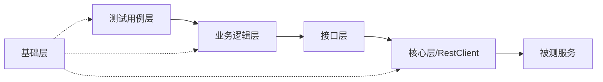

# Pytest 自动化测试框架 (python-autotest-trae)

本框架基于 Python + Pytest + Allure 构建，采用分层架构设计，旨在提供一套轻量级、易扩展、可维护的接口自动化测试解决方案。

---

## 1. 框架架构描述

本框架采用经典的**分层架构设计**，将测试数据、业务逻辑、接口定义与测试用例严格分离，确保了代码的高复用性和低耦合度。

结合项目中的 **“自动化测试框架架构图v1.0.png”**，架构共分为五大核心层级：

### 1.1 架构层级详解

1.  **测试层 (Test Layer)**
    *   **核心组件**：`testcases/` (Pytest测试用例), `conftest.py` (夹具/Fixture), `Allure` (测试报告)。
    *   **职责**：负责定义具体的测试场景和断言逻辑。测试用例通过调用业务逻辑层的接口来执行操作，并验证结果是否符合预期。`conftest.py` 负责测试前后的准备与清理工作（如数据库初始化、用户登录等）。
    *   **优势**：测试脚本专注于业务流程的验证，无需关心底层的 HTTP 请求实现。

2.  **业务逻辑层 (Business Layer)**
    *   **核心组件**：`operation/` (如 `UserBusiness`)。
    *   **职责**：对基础接口进行业务级别的封装。例如，将“输入用户名密码”和“点击登录”组合成一个“登录业务”方法。它负责处理复杂的业务逻辑判断，向上层提供更易用的业务关键字。
    *   **优势**：实现了业务逻辑的复用，当业务流程变化时，只需修改此层，无需大规模修改测试用例。

3.  **接口层 (API Layer)**
    *   **核心组件**：`api/` (如 `User.py`)。
    *   **职责**：单纯的接口定义层，与后端 API 接口一一对应。负责定义接口的 URL、Method、Headers 等信息，不包含复杂的业务逻辑。
    *   **优势**：将接口定义独立出来，当后端接口路径变更时，只需在此处修改。

4.  **核心层 (Core Layer)**
    *   **核心组件**：`core/rest_client.py` (Rest客户端), `core/result_base.py` (统一响应对象)。
    *   **职责**：框架的底层引擎。
        *   **Rest客户端**：对 `requests` 库进行二次封装，统一处理 Session 管理、异常捕获、日志记录等。
        *   **基础结果对象**：统一封装接口响应，提供标准化的 `success`, `code`, `msg`, `data` 属性，简化断言编写。

5.  **基础层 (Infrastructure)**
    *   **核心组件**：`config/` (配置), `data/` (数据), `common/` (DB/Logger)。
    *   **职责**：提供全框架通用的基础服务。
        *   **配置管理**：加载 `ini` 配置文件，支持多环境切换。
        *   **数据驱动**：读取 YAML/Excel 测试数据，实现数据与代码分离。
        *   **工具支持**：提供数据库操作、日志记录、文件读取等通用工具。

### 1.2 架构数据流向



---

## 2. 目录结构说明

以下是框架的标准目录结构及其职责说明：

```text
python-autotest-trae/
├── api/                        # 【接口层】API 接口定义
│   ├── __init__.py
│   └── User.py                 # 用户模块接口定义（URL, Method等）
│
├── common/                     # 【基础层】通用工具类
│   ├── logger.py               # 日志记录工具
│   ├── mysql_operate.py        # 数据库操作封装
│   └── read_data.py            # 数据读取工具（YAML解析）
│
├── config/                     # 【基础层】全局配置
│   ├── env_dev.ini             # 开发环境配置
│   ├── env_test.ini            # 测试环境配置
│   ├── setting.ini             # 全局通用配置
│   └── mysql.ini               # 数据库连接配置
│
├── core/                       # 【核心层】框架核心组件
│   ├── rest_client.py          # HTTP 请求客户端封装 (Requests)
│   └── result_base.py          # 统一响应结果对象封装
│
├── data/                       # 【基础层】测试数据
│   ├── api_test_data.yml       # 接口测试用例数据（数据驱动）
│   └── base_data.yaml          # 基础配置数据
│
├── operation/                  # 【业务层】业务逻辑封装
│   └── User.py                 # 用户相关业务流程封装（如：登录、注册逻辑）
│
├── report/                     # 【测试层】测试报告目录
│   ├── allure-results/         # Allure 原始结果数据 (JSON)
│   └── allure-html/            # Allure 生成的 HTML 报告
│
├── testcases/                  # 【测试层】测试用例脚本
│   ├── api_test/               # API 接口测试用例集
│   │   ├── conftest.py         # 模块级 Fixture
│   │   ├── test_01_get_user_info.py
│   │   ├── test_02_register.py
│   │   └── test_03_login.py
│   ├── conftest.py             # 全局 Fixture
│   └── __init__.py
│
├── utils/                      # 辅助工具目录
│
├── app.py                      # 框架统一执行入口（一键运行测试并生成报告）
├── pytest.ini                  # Pytest 核心配置文件（Marker, 插件配置）
├── requirements.txt            # 项目依赖库列表
└── README-V1.0.MD              # 项目说明文档
```

---

## 3. 快速上手指南

### 3.1 环境准备
1.  安装 Python 3.8+
2.  安装依赖库：
    ```bash
    pip install -r requirements.txt
    ```
3.  配置 Allure 环境（需安装 Java 并配置 Allure 命令行工具到系统 PATH）。

### 3.2 运行测试
使用根目录下的 `app.py` 脚本即可一键完成“清理旧报告 -> 执行测试 -> 生成报告 -> 打开报告”的全流程：

```bash
python app.py
```

### 3.3 编写测试用例
1.  **定义接口**：在 `api/` 目录下创建对应的接口类。
2.  **封装业务**：在 `operation/` 目录下组合接口调用，形成业务关键字。
3.  **准备数据**：在 `data/` 目录下编写 YAML 测试数据。
4.  **编写用例**：在 `testcases/` 目录下创建 `test_*.py` 文件，使用 Pytest 编写测试函数。

---

## 4. 技术栈

*   **语言**：Python 3
*   **测试框架**：Pytest
*   **HTTP请求**：Requests
*   **测试报告**：Allure
*   **数据驱动**：PyYAML
*   **数据库**：PyMySQL
